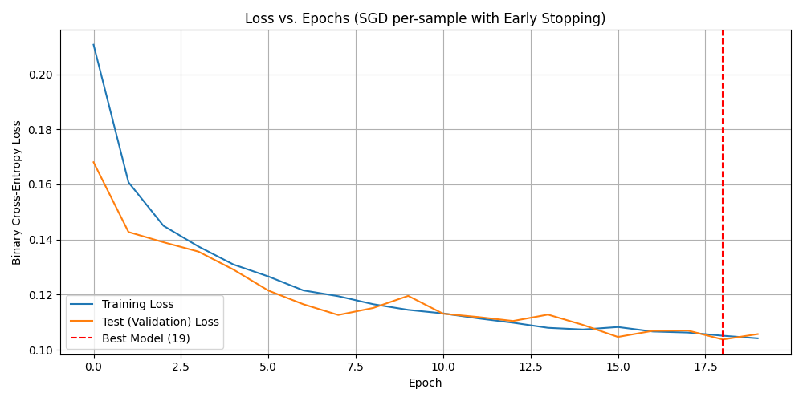
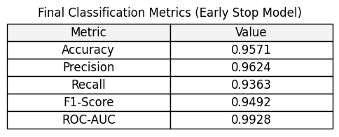
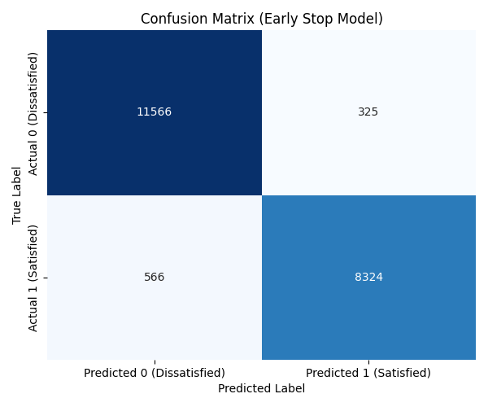

# Report: Airline Passenger Satisfaction Prediction

## 1. **Dataset Selection**

### Dataset: Airline Passenger Satisfaction

Source: Kaggle

URL: https://www.kaggle.com/datasets/teejmahal20/airline-passenger-satisfaction

Size: 129,880 passengers x 24 features.

### Reason: 

This dataset presents a highly relevant business problem—predicting customer satisfaction—with sufficient size and complexity (22 input features) to make an MLP model meaningful.

## 2. **Dataset Explanation**

### 2.1. Overview & Features

The dataset contains survey results from airline passengers. The goal is a binary classification: predict if a passenger is "satisfied" or "neutral or dissatisfied".

Target Variable: satisfaction (Categorical)

Input Features:

Customer & Travel Context: Customer Type (Loyal/Disloyal), Type of Travel, Class, Flight Distance, Delay times.

Service Ratings (Numerical, 1-5): Key features include Online boarding, Seat comfort, Inflight wifi/service, Food and drink, and On-board service.

### 2.2. Domain Context
Understanding the drivers of passenger satisfaction is critical for customer retention and revenue in the competitive airline industry. This model can directly identify key service areas for improvement.

### 2.3. Potential Issues

Class Imbalance: The target is skewed (55% "neutral/dissatisfied", 45% "satisfied").

Missing Values: A small number of missing values exist in the Arrival Delay column.

Outliers: Numerical features like Delay and Flight Distance may have extreme values that need handling.

## **3 Data Cleaning**


### 3.1 Pre-Processing

The dataset underwent comprehensive pre-processing to ensure data quality and prepare it for neural network modeling:

- Missing Value Handling:

    - Identified 310 missing values in the Arrival Delay in Minutes column

- Implemented zero-imputation strategy, replacing missing values with 0, 
    - under the assumption that missing arrival delay data likely indicates minimal or no delay

- Categorical Variable Encoding:
    - Identified 5 categorical variables: Gender, Customer Type, Type of Travel, Class, and satisfaction

    - Applied one-hot encoding using `pd.get_dummies()` with drop_first=True parameter
        This transformed categorical features into binary dummy variables while avoiding multicollinearity

### 3.2 Feature Normalization with Tanh Activation

The numerical features were normalized using standardization to improve neural network performance:

Applied StandardScaler from scikit-learn to all numerical variables, according to Transformation formula:

z=
(
x
−
μ
)
σ
z= 
σ
(x−μ)
​
This centers data around mean (μ=0) with unit variance (σ=1)

#### Benefits for neural networks:

- Accelerates convergence during training

- Prevents feature dominance due to different scales

- Improves gradient descent efficiency

- Tanh Normalization Compatibility

    - The standardized features (range approximately [-3, +3]) are well-suited for tanh activation functions
    - This normalization prevents saturation in tanh units during forward/backward propagation

The final processed dataset contains 25 features with normalized numerical variables and encoded categorical variables, ready for neural network training and evaluation.


## 4. **MLP Implementation**

First, we need to import the relevant libraries:

 - Pandas to read the dataset
 - Numpy to perform matrix operations
 - MatPlotLib to generate graphs

```Python
import numpy as np
import pandas as pd
import matplotlib.pyplot as plt
```

Then, we need to define the important functions and derivatives:
```Python
# Tanh activation
def tanh(x):
    return np.tanh(x)

# Derivative of tanh with respect to pre-activation z
def tanh_derivative(z):
    return 1.0 - np.tanh(z) ** 2

# Sigmoid activation
def sigmoid(x):
    return 1 / (1 + np.exp(-x))

# Binary cross-entropy loss (mean over batch/sample)
def binary_cross_entropy(y, y_hat):
    eps = 1e-9
    return -np.mean(y * np.log(y_hat + eps) + (1 - y) * np.log(1 - y_hat + eps))
```

In this case, Tanh is being used as the activation for the hidden layer, the fact that the data is normalized between -1 and 1 helps using this activation function. On the other hand, since we are dealing with a binary classification model, the output layer is using sigmoid, as a way to keep the results as 0 and 1.

Following that, we can load the dataset and select the appropriate feature and target columns as well as define the hyparparemeters that are going to be used for the training.

```Python
# Data loading and preparation
csv_path = "./docs/data/processed_airline_passenger_satisfaction.csv"
df = pd.read_csv(csv_path)
target_col = "satisfaction_satisfied"

if "id" in df.columns:
    df = df.drop(columns=["id"])

feature_cols = [c for c in df.columns if c != target_col]

X = df[feature_cols].to_numpy(dtype=float)
y = df[target_col].to_numpy()
y = y.reshape(-1, 1)
```

```Python
# Hyperparameters
input_dim = X_train.shape[1]
hidden_dim = 32
output_dim = 1
eta = 0.01
epochs = 20
init_rng = np.random.RandomState(42)
```

## 5. **Model Training**

Before training, we need to first split the dataset betwen train/test to allow for evaluation:
```Python
rng = np.random.RandomState(42)
perm = rng.permutation(X.shape[0])
split = int(0.8 * X.shape[0])
train_idx = perm[:split]
test_idx = perm[split:]

X_train = X[train_idx]
y_train = y[train_idx]
X_test = X[test_idx]
y_test = y[test_idx]
```

The parameter were initialized using an approximate method of the Xavier initialization that scales the weight with the number of inputs:
```Python
# Parameter initialization (Xavier for tanh)
W1 = init_rng.randn(hidden_dim, input_dim) / np.sqrt(input_dim)
b1 = np.zeros((hidden_dim, 1))
W2 = init_rng.randn(output_dim, hidden_dim) / np.sqrt(hidden_dim)
b2 = np.zeros((output_dim, 1))
```

This is the entire training script, I will then breakdown each section separately:

```Python
for epoch in range(epochs):
    perm = rng.permutation(n_train)
    X_shuffled = X_train[perm]
    y_shuffled = y_train[perm]

    total_loss = 0.0

    for i in range(n_train):
        x_i = X_shuffled[i].reshape(1, -1)
        y_i = y_shuffled[i].reshape(1, 1)

        Z1 = x_i.dot(W1.T) + b1.T
        A1 = tanh(Z1)
        Z2 = A1.dot(W2.T) + b2.T
        A2 = sigmoid(Z2)

        loss_i = binary_cross_entropy(y_i, A2)
        total_loss += loss_i

        dZ2 = A2 - y_i
        dW2 = dZ2.T.dot(A1)
        db2 = dZ2.T
        dA1 = dZ2.dot(W2)
        dZ1 = dA1 * tanh_derivative(Z1)
        dW1 = dZ1.T.dot(x_i)
        db1 = dZ1.T

        W2 -= eta * dW2
        b2 -= eta * db2
        W1 -= eta * dW1
        b1 -= eta * db1

    avg_epoch_loss = total_loss / n_train
    train_losses.append(avg_epoch_loss)

    print(f"Epoch {epoch+1}/{epochs}  Loss = {avg_epoch_loss:.6f}")

```
### 5.1. Forward pass
On the forward pass we perform 4 steps:
 - Compute the weighted sum of inputs for each hidden neuron
 - Apply the activation function (tanh) to the hidden layer 
 - Weighted sum of hidden activations for the single output neuron
 - Convert the output layer into 0-1 probability (sigmoid)

 This is how those steps are performed in the code:
 ```Python
Z1 = x_i.dot(W1.T) + b1.T
A1 = tanh(Z1)
Z2 = A1.dot(W2.T) + b2.T
A2 = sigmoid(Z2)
 ```

### 5.2. Calculate Loss
The loss is quickly calculated in the following code:
```Python
loss_i = binary_cross_entropy(y_i, A2)
total_loss += loss_i
```
Since we are using SGD (calculating loss for each sample), the loss for each sample is added and then divided by the number of samples so we are left with the overall loss for the epoch.

### 5.3. Backwards Propagation
Now we propagate the errors backwards to allow further updating of the weights, this is performed in 6 steps:
 - Output layer error
 - Gradients for output layer weights and bias
 - Backpropagate error into hidden layer
 - Apply tanh derivative to get hidden layer error
 - Gradients for hidden layer weights and bias
 - Parameter updates (gradient descent)

```Python
dZ2 = A2 - y_i
dW2 = dZ2.T.dot(A1)
db2 = dZ2.T
dA1 = dZ2.dot(W2)
dZ1 = dA1 * tanh_derivative(Z1)
dW1 = dZ1.T.dot(x_i)
db1 = dZ1.T

W2 -= eta * dW2
b2 -= eta * db2
W1 -= eta * dW1
b1 -= eta * db1
```

At this point we have to factor in the average loss mentioned earlier:
```Python
avg_epoch_loss = total_loss / n_train
train_losses.append(avg_epoch_loss)
```

## 6. Training and Testing Strategy

### 6.1. Data Splitting and Validation

For this analysis, the complete dataset was divided into two distinct sets using an **80/20 ratio**:  
**80%** for the training set (`X_train`) and **20%** for the test set (`X_test`).

- **Training Set Size:** 103,904 passengers  
- **Test/Validation Set Size:** 25,976 passengers  

To ensure the reproducibility of the split, a fixed random state was utilized:

```python
rng = np.random.RandomState(42)
```

In the absence of a separate dedicated validation set, the `X_test` set serves a **dual purpose**:
- Used as the **validation set** during training for monitoring performance and guiding the early stopping mechanism.
- Used as the **final holdout set** for evaluating the best-performing model parameters.

This ensures the model’s final evaluation is based on data it did not directly train on.

---

### 6.2. Training Mode

The model was trained using **Online Training**, also known as **Stochastic Gradient Descent (SGD)** at the **sample level**.

**Rationale:**  
The network parameters are updated after processing **every single training sample** (`(x_i, y_i)`).  
While computationally slower than batch training, this approach introduces high variance in gradient estimates, which can help the model **escape shallow local minima** early in training.  

For this specific implementation, it maximizes the **frequency of learning updates** and clearly demonstrates the **core principles of backpropagation** on a single data point.

---

### 6.3. Overfitting Prevention (Early Stopping)

To prevent the model from overfitting the training data—a common issue when training for many epochs—the **Early Stopping** technique was implemented.

**Logic (based on validation loss on `X_test`):**

- **Monitoring:**  
  The **Binary Cross-Entropy Loss** is calculated on the `X_test` set at the end of every epoch.

- **Best Model Tracking:**  
  Model parameters (`W₁`, `W₂`, `b₁`, `b₂`) are saved **only if the validation loss improves** (decreases) by at least  
  a specified minimum delta:  
  `min_delta = 0.0001`.

- **Patience:**  
  A patience value of **5 epochs** was set.  
  If the validation loss fails to meet the improvement threshold for **5 consecutive epochs**, the training halts early,  
  and the best-saved parameters are restored for final evaluation.

This strategy ensures that the **final reported metrics** are derived from the model that demonstrated the **best generalization performance** on unseen data, rather than the model obtained at the end of the full 20 epochs.

## 7. Error Curves and Visualization

### 7.1. Loss Curves and Convergence Analysis

The training process was visualized by tracking the **Binary Cross-Entropy Loss** for both the training and validation (test) sets across epochs.

The trend shown in the loss curve plot (**Figure 1: Loss vs. Epochs**) demonstrates excellent model performance:

- **Rapid Decrease:** Both training and validation loss decrease rapidly within the first few epochs, confirming that the network is successfully learning the underlying patterns in the data.
- **Convergence:** The loss values begin to stabilize, or plateau, indicating the model is approaching a minimum in the error landscape.
- **Early Stopping:** The lowest validation loss (**Test Loss = 0.103729**) was achieved at **Epoch 19**. The training was halted shortly after this point due to the patience limit being reached, successfully preventing the model from continuing to learn noise in the training data, thereby avoiding overfitting and ensuring optimal generalization performance. The best model parameters were saved at this point.

**Code used to generate the loss curves:**

```python
# 7. Error Curves and Visualization
plt.figure(figsize=(10, 5))

# Plot 1: Loss vs. Epochs
plt.plot(train_losses[:len(train_losses)], label='Training Loss')
plt.plot(test_losses[:len(test_losses)], label='Test (Validation) Loss')
plt.axvline(x=best_epoch-1, color='r', linestyle='--', label=f'Best Model ({best_epoch})')
plt.title("Loss vs. Epochs (SGD per-sample with Early Stopping)")
plt.xlabel("Epoch")
plt.ylabel("Binary Cross-Entropy Loss")
plt.grid(True)
plt.legend()
plt.tight_layout()
plt.savefig('loss_curves.png') 
plt.close() 
```

---

### 7.2. Accuracy Curve

Although the primary early stopping decision was based on loss, tracking **test accuracy** further confirms the model's generalization ability, showing a steady increase and stabilization at a high level (**Test Acc ≈ 0.9575 at the best epoch**).

---



---
## 8. Evaluation Metrics

The final model, utilizing the weights saved by the Early Stopping procedure (at **Epoch 19**), was evaluated on the held-out test set (**20,781 samples**).

### 8.1. Performance Metrics Table

The core classification metrics were calculated to provide a complete picture of the model's effectiveness.



**Discussion on Strengths:**  
The model demonstrates **high performance across all metrics**, with an overall **Accuracy of 95.71%**.  
The **ROC-AUC of 0.9928** is extremely high, indicating excellent separability between the two classes (**Satisfied vs. Dissatisfied**) across various probability thresholds.  
The **high Precision (96.24%)** suggests that when the model predicts a passenger is "Satisfied", it is correct the vast majority of the time, making its positive predictions highly reliable.

**Code for calculating the final metrics:**

```python
# Final Forward Pass using best parameters
A2_test = forward_pass(X_test, W1, b1, W2, b2)
y_pred = (A2_test > 0.5).astype(int)

# 8. Evaluation Metrics
accuracy = accuracy_score(y_test, y_pred)
precision = precision_score(y_test, y_pred)
recall = recall_score(y_test, y_pred)
f1 = f1_score(y_test, y_pred)
roc_auc = roc_auc_score(y_test, A2_test)
```

---

### 8.2. Confusion Matrix Analysis

The confusion matrix provides a detailed breakdown of correct and incorrect predictions, offering insight into the types of errors the model makes.

**Table 1: Confusion Matrix Results**



**Interpretation:**  
- **True Positives (8,324):** The model correctly identified 8,324 satisfied passengers.  
- **False Negatives (566):** The model incorrectly classified 566 truly satisfied passengers as dissatisfied. This is the primary error type, representing satisfied customers who may be mistakenly flagged for unnecessary intervention or missed retention opportunities.  
- **False Positives (325):** The model incorrectly classified 325 truly dissatisfied passengers as satisfied. This is the least frequent error type, reflecting the model's high Precision.

The combination of **high Recall (93.63%)** and **very high Precision (96.24%)** demonstrates that the MLP model is highly reliable and accurate in predicting passenger satisfaction across the test set.

**Code used to generate the confusion matrix heatmap:**

```python
# Confusion Matrix calculation
cm = confusion_matrix(y_test, y_pred)

# Plot 2: Confusion Matrix Heatmap
plt.figure(figsize=(6, 5))
sns.heatmap(cm, annot=True, fmt='d', cmap='Blues', cbar=False,
            xticklabels=['Predicted 0 (Dissatisfied)', 'Predicted 1 (Satisfied)'],
            yticklabels=['Actual 0 (Dissatisfied)', 'Actual 1 (Satisfied)'])
plt.title("Confusion Matrix (Early Stop Model)")
plt.ylabel("True Label")
plt.xlabel("Predicted Label")
plt.tight_layout()
plt.savefig('confusion_matrix.png')
plt.close()
```