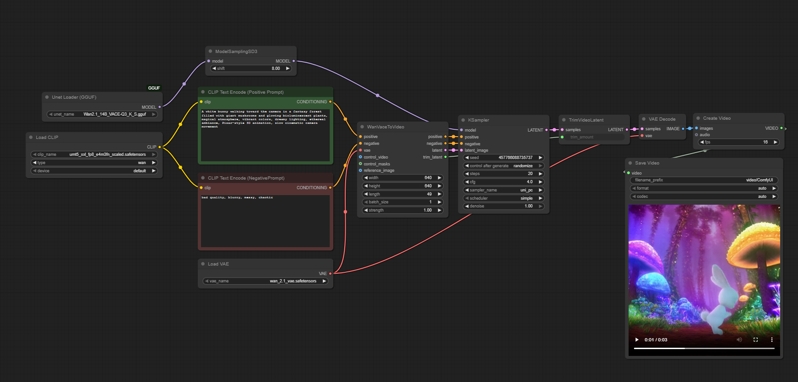
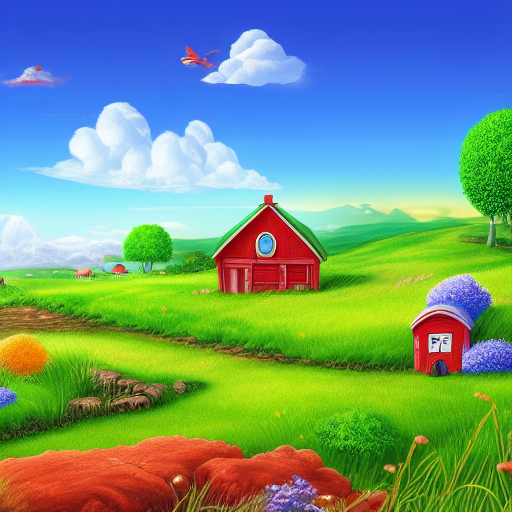
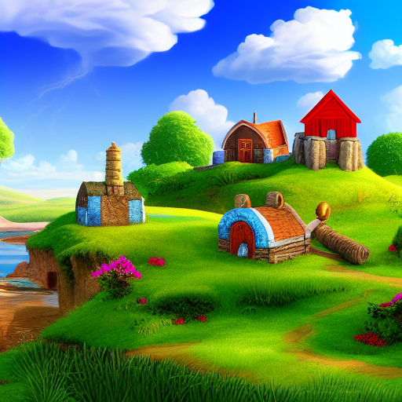

# Text/Image to Video Model

## 1. Core Workflow and Components

This workflow uses a *latent video diffusion pipeline* to convert text prompts into a fully generated video. The model interprets the prompt, generates video frames inside latent space, and finally decodes them into real pixel images. The pipeline relies on four key components: the **Diffusion Model**, **CLIP**, **VAE**, and **Model Sampling**.

---

### 1.1. Diffusion Model

The diffusion model (WAN video model) is the engine responsible for creating the actual visual content and motion of the video. It operates fully in *latent space* rather than pixel space, which allows high-quality video synthesis with manageable compute.

The model begins from random latent noise and progressively refines it over several steps, shaping it into temporally consistent video frames. During refinement, it incorporates guidance from the positive and negative prompt embeddings, enforcing the desired visual style, subject appearance, lighting, scene layout, motion, and cinematic behavior.


Key responsibilities:

- Generates latent video frames from noise
- Maintains temporal and spatial consistency across frames
- Adapts to the prompt’s style, mood, and subject description

---

### 1.2. CLIP

CLIP serves as a text encoder, converting prompts into vector representations (embeddings) that the diffusion model can understand. It does not generate images or video by itself. Instead, it communicates the meaning of the prompt.

Two embeddings are used:

- **Positive Prompt Embedding**: pushes the model toward desired attributes, objects, and styles
- **Negative Prompt Embedding**: discourages unwanted artifacts such as blur, noise, distortions, or style deviations

CLIP determines what the video should or should not look like, and the diffusion model uses this information during the generative process.

---

### 1.3. VAE

The Variational Auto-Encoder (VAE) handles the conversion between latent space and pixel space. During video generation, the diffusion model outputs a sequence of latent frames rather than visible images. The VAE takes these latent frames and decodes them into real RGB visuals, acting as the final rendering stage of the pipeline.

Responsibilities of the VAE decoder:

- Converts latent video representations into full-resolution frames
- Preserves textures, sharpness, lighting, and color dynamics
- Adds visual detail that cannot be represented directly inside the diffusion model

Without the VAE, video frames would remain encoded numerical structures instead of displayable images.

---

### 1.4. Model Sampling

Model sampling determines how latent noise is iteratively refined into a coherent video. Sampling settings define the trajectory of denoising across time, impacting stability, detail, and style.

The sampling module controls parameters such as:

- Number of diffusion steps
- Type of sampler (e.g., uni_pc)
- Scheduler behavior
- Denoising strength and balancing between noise removal and prompt adherence
- Random seed and generation reproducibility

Sampling = the route the model takes from noise to final video. Different samplers and step counts influence cinematic smoothness, character consistency, and level of detail.


### 1.5. Model Details

The workflow is built on three core pretrained components: the diffusion model, the text encoder, and the VAE. Together, they define both the expressiveness of the video generation and the computational cost.

- **Diffusion Model** (Wan2.1-VACE-14B-Q3)  
  A large 14-billion-parameter transformer-based video diffusion model trained for text-to-video and image-to-video tasks.  
  The *Q3* quantized version allows the model to run with significantly reduced VRAM usage while maintaining high visual fidelity and temporal consistency.  
  Official files and weights used in this project can be found here:  
  **https://huggingface.co/QuantStack/Wan2.1_14B_VACE-GGUF/tree/main**

- **Text Encoder** (UMT5-XXL FP8)  
  A very large T5-style language model that converts prompts into dense embeddings.  
  Its strong semantic understanding enables detailed, narrative, and stylistic control over the generated video.

- **VAE** (Wan-2.1 VAE)  
  A spatio-temporal Variational Auto-Encoder responsible for decoding latent video frames into full-resolution RGB outputs.  
  It preserves fine texture, sharpness, lighting, and color dynamics across frames, ensuring temporal coherence.

In combination, these models form a high-capacity video generation system capable of producing coherent motion, consistent subjects, and cinematic rendering while remaining computationally feasible through mixed quantization.


### 1.6. Finished Workflow and Results
This is a screenshot of the complete workflow:


This is the postive prompt used:
```text
A sword embedded in a pile of burning wood, the fire moving naturally, glowing embers and smoke rising in a dark background, volumetric lighting, detailed textures
```
This is the negative prompt used:
```text
bad quality, blurry, messy, chaotic
```

This is the video generated by those prompts:
<video controls width="100%" style="max-width: 800px;">
  <source src="bonfire_vid.mp4" type="video/mp4">
  Your browser does not support the video tag.
</video>


### 1.7. LoRA Enhancement Module

The LoRA (Low-Rank Adaptation) Enhancement Module adds an additional layer of specialization on top of the base Text-to-Video diffusion model. Instead of replacing the original network weights, a LoRA injects small “delta” matrices into selected layers of both the UNet (video generation network) and the CLIP text encoder. This enables the workflow to alter or reinforce specific behaviors of the model such as motion style, camera dynamics, subject consistency, or domain-specific aesthetics, without the computational cost of loading or retraining a full fine-tuned model.

In this workflow, the **Power LoRA Loader** node receives the base diffusion model and the CLIP text encoder as inputs, and it applies the selected LoRA file directly onto them. The `Strength` parameter controls how much influence the LoRA has over the generation process:

The LoRA used in this workflow — **`Wan21_CausVid_14B_T2V_lora_rank32`**  is designed to improve temporal coherence and natural motion for Text-to-Video generation. It enhances camera tracking, reduces flickering between frames, and strengthens identity consistency across the entire clip. Because it works in combination with the core Wan 2.1 diffusion model, it enables improved controllability and animation quality while preserving the model’s full knowledge base and visual capability.

Additionally, for this version of the workflow, an image is used as a reference for the video generation, this makes it so the model carries a specific look into the generated animation, enhancing consistency and identity. This is the reference image used:


### 1.8. Finished Workflow and Results (with LORA and reference image)
This is a screenshot of the complete workflow, the new Power Lora Loader block can be seen in blue:


Both the positive and negative prompts remained the same.

This is the resulting video:
<video controls width="100%" style="max-width: 800px;">
  <source src="bonfire_lora.mp4" type="video/mp4">
  Your browser does not support the video tag.
</video>

---

# Text To Image Model

## 1. Core Workflow and Components

This workflow utilizes a **latent image diffusion pipeline** to convert text prompts into a fully generated static image. The model interprets the prompt, generates an image inside latent space, and finally decodes it into a real pixel image. The pipeline relies on three main components: the **Diffusion Model**, **CLIP**, and **VAE**.

---

### 1.1. Diffusion Model (UNet)

The diffusion model, specifically the **UNet** architecture within a larger checkpoint, is the engine responsible for creating the actual visual content of the image. It operates fully in *latent space* rather than pixel space, which allows for high-quality image synthesis with manageable compute.

The process starts from **random latent noise** (initialized by the `EmptyLatentImage` node) and progressively refines it over several **sampling steps**. During this refinement (managed by the `KSampler` node), the model incorporates guidance from the prompt embeddings (positive and negative), enforcing visual style, subject appearance, and scene layout.

Key responsibilities:

* Generates the latent image from noise.
* Maintains spatial consistency and composition.
* Adapts to the prompt's style and subject description.

---

### 1.2. CLIP (Text Encoder)

CLIP serves as the **text encoder** (using the `CLIPTextEncode` nodes), converting prompts into **vector representations (embeddings)** that the diffusion model can understand. It does not generate the image by itself but communicates the *meaning* of the prompt.

Two embeddings are used:

* **Positive Prompt Embedding**: Pushes the model toward desired attributes, such as "a small red house on a green hill."
* **Negative Prompt Embedding**: Discourages unwanted artifacts, such as "low quality, bad lightning, decentralized."

The embeddings are passed to the `KSampler` node, which uses them to guide the denoising process.

---

### 1.3. VAE (Variational Auto-Encoder)

The Variational Auto-Encoder (**VAE**) handles the critical conversion between latent space and pixel space. The diffusion model (UNet) outputs a latent image—a highly compressed, non-visual numerical structure. The VAE takes this latent image (from the `KSampler` node's output) and **decodes** it into a real RGB image (using the `VAEDecode` node), acting as the final rendering stage of the pipeline.

Responsibilities of the VAE decoder:

* Converts the latent image representation into a full-resolution pixel image.
* Preserves textures, sharpness, lighting, and color dynamics.
* Enables the image to be displayed and saved (`SaveImage` node).

---

### 1.4. KSampler and Model Sampling

The **KSampler** node is the core mechanism that controls **how** latent noise is iteratively refined into a coherent image. It is the implementation of the *Model Sampling* concept.

The `KSampler` controls key generation parameters:

| Parameter | Value | Description |
| :--- | :--- | :--- |
| **seed** | `152643018321775` | Ensures reproducibility for the initial noise state. (Used 5 different seeds) |
| **steps** | `20` | The number of denoising iterations. Higher steps usually mean more detail. |
| **cfg** | `8` | **Classifier Free Guidance** determines how strongly the model follows the prompt. Higher values increase adherence but can introduce artifacts. |
| **sampler\_name** | `euler` | The specific mathematical algorithm used for the denoising steps. |
| **scheduler** | `simple` | The schedule for noise injection/removal across steps. |
| **denoise** | `1` | Indicates a full denoising process from pure noise to a final image. |

Using the **Model**, **Positive** and **Negative** embeddings, and the **Latent Image**, the KSampler orchestrates the generative process by iteratively refining the latent noise.

---

### 1.5. Model Details

The file used, `v1-5-pruned-emaonly.safetensors`, is a specialized version of the Stable Diffusion v1.5 latent text-to-image diffusion model. Which can be found here:

**https://huggingface.co/stable-diffusion-v1-5/stable-diffusion-v1-5**

#### Key Characteristics of the ModelBase Model: Stable Diffusion v1.5 

- Optimization: The pruned-emaonly designation means the model is optimized for inference (generation) rather than fine-tuning.
- Pruned: Unnecessary parameters, such as the optimizer states and non-EMA weights, have been removed.
- EMA-Only: It retains only the Exponential Moving Average (EMA) weights, which typically provide the best image quality during generation while reducing the VRAM footprint and overall file size (around 4.27 GB).
- Architecture: It uses the Latent Diffusion Model (LDM) architecture.
- Native Resolution: The primary training resolution is $512 \times 512$ pixels, which is why the workflow uses this size for the EmptyLatentImage node.
- File Format: The .safetensors format is used for enhanced security and faster loading compared to older .ckpt files.

The workflow is built on three core pretrained components, all loaded via the `CheckpointLoaderSimple`: the diffusion model (UNet), the text encoder (CLIP), and the VAE.

* **Diffusion Model (UNet)**
    * **Source:** Contained within the `v1-5-pruned-emaonly.safetensors` checkpoint.
    * **Function:** Generates the latent representation of the image.
* **Text Encoder (CLIP)**
    * **Source:** Contained within the `v1-5-pruned-emaonly.safetensors` checkpoint.
    * **Function:** Converts the textual prompts into numerical embeddings.
* **VAE**
    * **Source:** Contained within the `v1-5-pruned-emaonly.safetensors` checkpoint.
    * **Function:** Decodes the final latent sample into a viewable RGB image.

The use of a single checkpoint simplifies the setup, ensuring all components are compatible and aligned for high-quality image generation.

---

### 1.6. Finished Workflow and Results

This is how the complete workflow looks:


**Positive Prompt:**
```text
A fantasy landscape with a small red house on a green hill, bright blue sky, and fluffy white clouds, highly detailed, vibrant colors, 4k resolution
```

**Negative Prompt:**
```text
low quality, bad lighting, descentralized, blurry, distorted
```

**Generated Images:**


 


