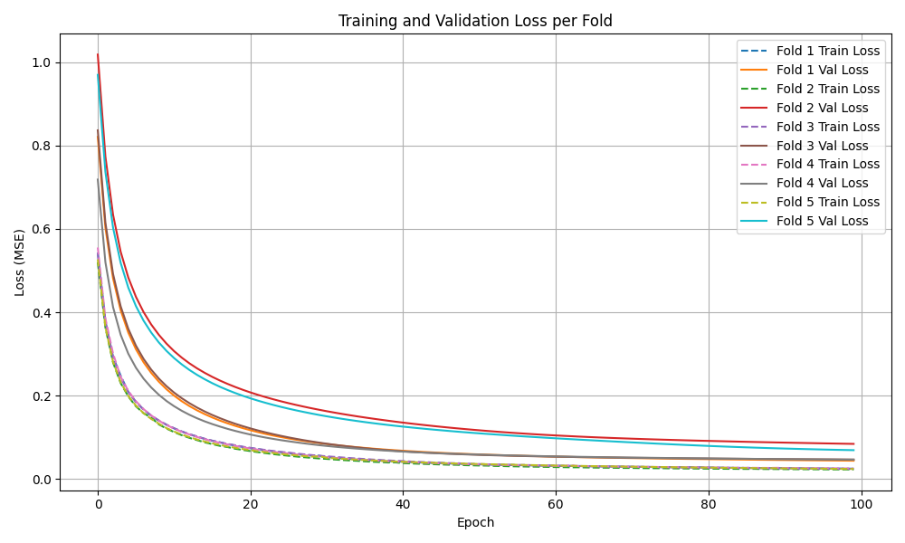
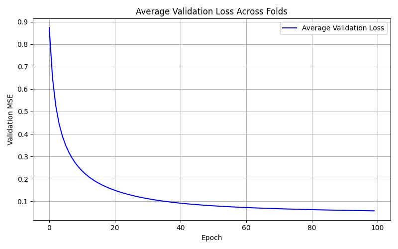
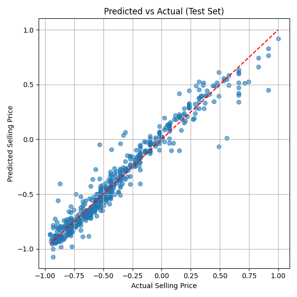

# Vehicle Price Data Preprocessing & EDA

## 1. Dataset Selection and Overview

### 1.1. Dataset Information

Source: Kaggle

URL: [Vehicle Dataset from CarDekho](https://www.kaggle.com/datasets/nehalbirla/vehicle-dataset-from-cardekho)

Size: 8 Columns and 4340 Rows

### 1.2. Selection Reason

This dataset presents a practical regression problem - predicting vehicle selling prices - with rich features including both numerical and categorical data, making it ideal for demonstrating MLP regression capabilities in real-world scenarios.

### 1.3. Overview & Features

The dataset contains information about used cars and their selling prices. The goal is regression: predict the selling price of a vehicle based on its characteristics.

Target Variable: selling_price (Numerical)

Input Features:

- Vehicle Specifications: year, km_driven
- Technical Details: fuel type, seller_type, transmission
- Brand Information: extracted from vehicle name to represent manufacturer
- Sales Context: selling_price as target variable

### 1.4. Domain Context

Accurate vehicle price prediction is essential in the automotive market, helping both dealers and customers make informed decisions. The model can identify key factors affecting a vehicle's resale value.

### 1.5. Potential Issues

- Outliers: Features like 'km_driven' and 'selling_price' contain extreme values requiring treatment
- Brand Diversity: High cardinality in vehicle names/brands needs careful handling
- Feature Scaling: Wide range of values across different features (year vs. km_driven)

## 2. Data Processing and Analysis

### 2.1. Data Loading and Feature Definition

The dataset is loaded from KaggleHub, and features are automatically categorized based on their data types.

```py
import pandas as pd
import numpy as np
from sklearn.model_selection import train_test_split
from sklearn.preprocessing import MinMaxScaler
import kagglehub
import os

# Load Data
path = kagglehub.dataset_download("nehalbirla/vehicle-dataset-from-cardekho")
df = pd.read_csv(os.path.join(path, "CAR DETAILS FROM CAR DEKHO.csv"), header=0)

# Feature Definitions
TARGET = 'selling_price'
CATEGORICAL_FEATURES = df.select_dtypes(include=['object']).columns.tolist()
NUMERICAL_FEATURES = df.select_dtypes(include=['number']).columns.tolist()

# Save original target values
df[f'{TARGET}_original'] = df[TARGET]

# Extract brand from name to reduce cardinality
df['brand'] = df['name'].str.split().str[0]
df.drop(columns=['name'], inplace=True)

# Update categorical features after brand extraction
CATEGORICAL_FEATURES = df.select_dtypes(include=['object']).columns.tolist()
```

### 2.2. Exploratory Data Analysis (EDA)

Initial analysis focuses on data structure, missing values, and distribution of features.

#### 2.2.1. Data Structure and Missing Values

Analysis of data completeness and feature distributions:

```py
# Inspect shapes and missing values
print("Shape:", df.shape)
print(df.isnull().sum())

Shape: (4340, 9)
year                      0
selling_price             0
km_driven                 0
fuel                      0
seller_type               0
transmission              0
owner                     0
selling_price_original    0
brand                     0
```

#### 2.2.2. Target Variable Analysis

Examination of the selling price distribution:

```py
# Target variable statistics
print(df['selling_price'].describe())

count    4.340000e+03
mean     5.041273e+05
std      5.785487e+05
min      2.000000e+04
25%      2.087498e+05
50%      3.500000e+05
75%      6.000000e+05
max      8.900000e+06
Name: selling_price, dtype: float64

# Histogram of selling prices
df['selling_price'].hist(bins=50)
```

[Prices Histogram](./prices_hist.png)

#### 2.2.3. Brand Distribution Analysis

Analysis of vehicle brands in the dataset:

```py
# Top 20 brands by frequency
print(df['brand'].value_counts().head(20))

brand
Maruti           1280
Hyundai           821
Mahindra          365
Tata              361
Honda             252
Ford              238
Toyota            206
Chevrolet         188
Renault           146
Volkswagen        107
Skoda              68
Nissan             64
Audi               60
BMW                39
Fiat               37
Datsun             37
Mercedes-Benz      35
Mitsubishi          6
Jaguar              6
Land                5
Name: count, dtype: int64
```

#### 2.2.4. Outlier Analysis

Analysis of numerical features for outlier detection using IQR method:

```py
# Outlier detection for key numerical features
for col in ['selling_price', 'km_driven']:
    Q1 = df[col].quantile(0.25)
    Q3 = df[col].quantile(0.75)
    IQR = Q3 - Q1
    lower = Q1 - 1.5 * IQR
    upper = Q3 + 1.5 * IQR
    print(f"{col} | lower: {lower:.2f}, upper: {upper:.2f}")

selling_price | lower: -400000.00, upper: 1200000.00
km_driven | lower: -35507.50, upper: 165304.50
Removed 291 outliers from the dataset.
```

## 3. Data Cleaning and Feature Engineering

The following steps are applied to prepare the data for consumption by a machine learning model.

### 3.1. Duplicates, Missing Values, and Outlier Treatment

- Duplicate Removal: Redundant entries are removed to ensure data quality
- Missing Value Treatment: Check and handle any missing values in both numerical and categorical features
- Outlier Handling: IQR method used to detect and filter outliers in key numerical features (selling_price, km_driven)

```py
# Remove Duplicates
initial_rows = df.shape[0]
df.drop_duplicates(inplace=True)

# Handle Missing Values
if df.isnull().sum().any():
    for col in NUMERICAL_FEATURES:
        df[col].fillna(df[col].median(), inplace=True)
    for col in CATEGORICAL_FEATURES:
        df[col].fillna(df[col].mode()[0], inplace=True)

# Filter Outliers using IQR method
for col in ['selling_price', 'km_driven']:
    Q1 = df[col].quantile(0.25)
    Q3 = df[col].quantile(0.75)
    IQR = Q3 - Q1
    lower = Q1 - 1.5 * IQR
    upper = Q3 + 1.5 * IQR
    df = df[(df[col] >= lower) & (df[col] <= upper)]
```

### 3.2. Feature Encoding and Scaling

The final steps involve encoding categorical variables and scaling numerical features to a consistent range:

```py
# One-Hot Encoding for Categorical Features
df_encoded = pd.get_dummies(df, columns=CATEGORICAL_FEATURES, drop_first=True, dtype=int)

# Identify features to scale (numerical features)
features_to_scale = [col for col in df_encoded.columns if col in NUMERICAL_FEATURES]

# Scale features to [-1, 1] range
scaler = MinMaxScaler(feature_range=(-1, 1))
df_encoded[features_to_scale] = scaler.fit_transform(df_encoded[features_to_scale])

# Save processed dataset
df_encoded.to_csv("../data/processed_vehicles.csv", index=False)
```

## 4. **MLP Implementation**

First, we need to import the relevant libraries:

 - Pandas to read the dataset
 - Numpy to perform matrix operations
 - MatPlotLib to generate graphs
 - Sklearn.metrics to calculate metrics of the regression model
 - 

```Python
import numpy as np
import pandas as pd
import matplotlib.pyplot as plt
from sklearn.metrics import mean_squared_error, mean_absolute_error, r2_score
import os
```

Then, we need to define the important functions and derivatives:
```Python
# Tanh activation
def tanh(x):
    return np.tanh(x)

# Derivative of tanh with respect to pre-activation z
def tanh_derivative(z):
    return 1.0 - np.tanh(z) ** 2

# Regression loss per-sample 0.5*MSE and full-dataset MSE 
def mse_loss(y_true, y_pred):
    # y_true and y_pred are arrays shaped (n_samples, 1)
    return np.mean((y_true - y_pred) ** 2)

def mse_loss_per_sample(y_true, y_pred):
    # use 0.5*(y - yhat)^2 so derivative is (yhat - y)
    return 0.5 * np.mean((y_true - y_pred) ** 2)
```

In this case, Tanh is being used as the activation for the hidden layer, the fact that the data is normalized between -1 and 1 helps using this activation function. Since this is a regression model, the output is linear, and has no activation. For this same reason, we are using MSE (mean squared error) to calculate the loss

Following that, we can load the dataset and select the appropriate feature and target columns as well as define the hyparparemeters that are going to be used for the training.

```Python
# Data loading and preparation
base_path = os.path.dirname(os.path.abspath(__file__))
csv_path = os.path.join(base_path, '..', '..', 'data', 'processed_vehicles.csv')
try:
    df = pd.read_csv(csv_path)
except FileNotFoundError:
    print(f"Error: File not found at {csv_path}. Using dummy data.")
    data = {'feature1': np.random.rand(200), 'feature2': np.random.rand(200), 'selling_price': np.random.rand(200)*1e5}
    df = pd.DataFrame(data)


TARGET = 'selling_price'
if TARGET not in df.columns:
    raise ValueError(f"Target column '{TARGET}' not found in DataFrame.")

# Drop id if present
if "id" in df.columns:
    df = df.drop(columns=["id"])

# Feature columns - drop any original/backup columns you don't want as features
backup_target_col = f"{TARGET}_original"
feature_cols = [c for c in df.columns if c not in (TARGET, backup_target_col)]

X = df[feature_cols].to_numpy(dtype=float)
y = df[[TARGET]].to_numpy(dtype=float)
```

```Python
# Hyperparameters
input_dim = X_train.shape[1]
hidden_dim = 32
output_dim = 1
eta = 0.01
epochs = 100
init_rng = np.random.RandomState(42)

# Early stopping params
patience = 10
min_delta = 1e-6
best_loss = np.inf
patience_counter = 0
```

## 5. **Model Training**

Before training, we need to first split the dataset betwen train/test to allow for evaluation:
```Python
rng = np.random.RandomState(42)
perm = rng.permutation(X.shape[0])
split = int(0.8 * X.shape[0])
train_idx = perm[:split]
test_idx = perm[split:]

X_train = X[train_idx]
y_train = y[train_idx]
X_test = X[test_idx]
y_test = y[test_idx]
```

The parameter were initialized using an approximate method of the Xavier initialization that scales the weight with the number of inputs:
```Python
# Parameter initialization (Xavier for tanh)
W1 = init_rng.randn(hidden_dim, input_dim) / np.sqrt(input_dim)
b1 = np.zeros((hidden_dim, 1))
W2 = init_rng.randn(output_dim, hidden_dim) / np.sqrt(hidden_dim)
b2 = np.zeros((output_dim, 1))

best_W1, best_b1, best_W2, best_b2 = W1.copy(), b1.copy(), W2.copy(), b2.copy()
```

This is the entire training script, I will then breakdown each section separately:

```Python
for epoch in range(epochs):
    perm = rng.permutation(n_train)
    X_shuffled = X_train[perm]
    y_shuffled = y_train[perm]

    total_train_loss = 0.0

    # SGD per-sample
    for i in range(n_train):
        x_i = X_shuffled[i].reshape(1, -1)
        y_i = y_shuffled[i].reshape(1, 1)

        # Forward
        Z1 = x_i.dot(W1.T) + b1.T
        A1 = tanh(Z1)
        Z2 = A1.dot(W2.T) + b2.T
        A2 = Z2

        # Loss (per-sample)
        loss_i = mse_loss_per_sample(y_i, A2)
        total_train_loss += loss_i

        # Backpropagation
        # dL/dA2 = A2 - y_i
        dZ2 = (A2 - y_i)
        dW2 = dZ2.T.dot(A1)
        db2 = dZ2.T

        dA1 = dZ2.dot(W2)
        dZ1 = dA1 * tanh_derivative(Z1)
        dW1 = dZ1.T.dot(x_i)
        db1 = dZ1.T

        # Parameter updates
        W2 -= eta * dW2
        b2 -= eta * db2
        W1 -= eta * dW1
        b1 -= eta * db1

    avg_train_loss = total_train_loss / n_train
    train_losses.append(avg_train_loss)

    # Validation loss (full test set)
    A2_val = forward_pass(X_test, W1, b1, W2, b2)
    val_mse = mse_loss(y_test, A2_val)
    val_losses.append(val_mse)

    print(f"Epoch {epoch+1}/{epochs} - Train Loss = {avg_train_loss:.8f} | Val MSE = {val_mse:.8f}")

```
### 5.1. Forward pass
On the forward pass we perform 4 steps:
 - Compute the weighted sum of inputs for each hidden neuron
 - Apply the activation function (tanh) to the hidden layer 
 - Weighted sum of hidden activations for the single output neuron
 - Produce linear real-valued output (suitable for continuous target)

 This is how those steps are performed in the code:
 ```Python
# Forward
Z1 = x_i.dot(W1.T) + b1.T
A1 = tanh(Z1)
Z2 = A1.dot(W2.T) + b2.T
A2 = Z2
 ```

### 5.2. Calculate Loss
The loss is quickly calculated in the following code:
```Python
# Loss (per-sample)
loss_i = mse_loss_per_sample(y_i, A2)
total_train_loss += loss_i
```
Since we are using SGD (calculating loss for each sample), the loss for each sample is added and then divided by the number of samples so we are left with the overall loss for the epoch.

### 5.3. Backwards Propagation
Now we propagate the errors backwards to allow further updating of the weights, this is performed in 6 steps:
 - Output layer error
 - Gradients for output layer weights and bias
 - Backpropagate error into hidden layer
 - Apply tanh derivative to get hidden layer error
 - Gradients for hidden layer weights and bias
 - Parameter updates (gradient descent)

```Python
dZ2 = A2 - y_i
dW2 = dZ2.T.dot(A1)
db2 = dZ2.T
dA1 = dZ2.dot(W2)
dZ1 = dA1 * tanh_derivative(Z1)
dW1 = dZ1.T.dot(x_i)
db1 = dZ1.T

W2 -= eta * dW2
b2 -= eta * db2
W1 -= eta * dW1
b1 -= eta * db1
```

At this point we have to factor in the average loss mentioned earlier:
```Python
avg_train_loss = total_train_loss / n_train
train_losses.append(avg_train_loss)
```

## 6. **Training and Testing Strategy**

### 6.1. Data Splitting Approach

The model employs a two-tier splitting strategy for robust evaluation:

```Python
# Primary split: 85% train/validation, 15% test
X_trainval, X_test, y_trainval, y_test = train_test_split(X, y, test_size=0.15, random_state=42)

# Secondary split: 5-fold cross-validation on training data
kf = KFold(n_splits=5, shuffle=True, random_state=42)
```

### 6.2. Training Methodology

**Mini-Batch Gradient Descent** was selected for optimal balance between computational efficiency and convergence stability:

```Python
batch_size = 16  # Balance between stochastic noise and batch stability
```

**Rationale**: Mini-batch training provides smoother convergence than pure stochastic gradient descent while remaining more memory-efficient than full-batch training, making it suitable for medium-sized datasets.

### 6.3. Overfitting Prevention

Multiple techniques combat overfitting:

```Python
# Early stopping with patience mechanism
patience = 10
min_delta = 1e-6
best_loss = np.inf
patience_counter = 0

# Cross-validation for robust performance estimation
kf = KFold(n_splits=5, shuffle=True, random_state=42)
```

**Early Stopping Logic**: Training halts if validation loss fails to improve by `min_delta` for `patience` consecutive epochs, preventing overfitting to training data.

### 6.4. Reproducibility and Validation

```Python
rng = np.random.RandomState(42)  # Fixed random seed
```

**Validation Role**: The holdout validation set monitors generalization performance during training and triggers early stopping, while k-fold cross-validation provides reliable performance estimates across different data partitions.

## 7. **Error Curves and Visualization**

### 7.1. Convergence Monitoring

Training and validation losses are tracked per epoch to analyze learning behavior:

```Python
train_losses = []
val_losses = []

# Record losses each epoch
train_losses.append(avg_train_loss)
val_losses.append(val_mse)
```

### 7.2. Loss Curve Analysis

Multiple visualization approaches provide comprehensive insights:

**Individual Fold Analysis**:

- Displays training and validation curves for all 5 folds
- Reveals consistency (or variability) across different data splits
- Identifies potential overfitting through train-val loss gaps

**Aggregate Performance**:

- Averages validation losses across all folds
- Shows overall model learning trend
- Highlights convergence point and training stability

### 7.3. Interpretation Guidelines

**Convergence Indicators**:
- Plateauing loss curves indicate model has learned available patterns
- Consistent decrease suggests ongoing learning potential
- Oscillating curves may indicate learning rate issues

**Overfitting Detection**:
- Growing gap between training and validation losses
- Validation loss increasing while training loss decreases
- Early stopping typically mitigates this risk

## 8. **Evaluation Metrics**

### 8.1. Comprehensive Regression Assessment

The model employs multiple metrics to evaluate different aspects of performance:

```Python
# Core regression metrics
mse = mean_squared_error(y_test_original, y_pred_test_original)
mae = mean_absolute_error(y_test_original, y_pred_test_original) 
rmse = np.sqrt(mse)
r2 = r2_score(y_test_original, y_pred_test_original)
```

### 8.2. Baseline Comparison

Performance is contextualized against a simple mean predictor baseline:

```Python
# Baseline model: predict mean of training data
mean_baseline = np.mean(y_trainval_original)
y_baseline = np.full_like(y_test_original, mean_baseline)

# Calculate baseline metrics
baseline_mse = mean_squared_error(y_test_original, y_baseline)
baseline_r2 = r2_score(y_test_original, y_baseline)
```

### 8.3. Results Interpretation

**Residual Analysis**:

- Points randomly scattered around diagonal indicate good fit
- Patterns suggest systematic prediction errors
- Outliers visible as points far from equality line

**Metric-Specific Insights**:
- **MSE/RMSE**: Penalizes large errors, sensitive to outliers
- **MAE**: More robust to outliers, interpretable in target units  
- **R²**: Proportion of variance explained, scale-independent

**Comparative Analysis**:

The model comparison results show the MLP significantly outperforms the baseline mean predictor:

| Model | MSE | RMSE | MAE | R² |
|-------|-----|------|-----|----|
| **MLP** | 0.0102 | 0.1009 | 0.0687 | **0.9451** |
| **Baseline (Mean)** | 0.2127 | 0.4612 | 0.3434 | -0.1475 |

*Note: The MLP model achieves excellent performance with R² = 0.945, explaining 94.5% of the variance in vehicle prices, while the baseline model performs worse than simply predicting the mean (negative R²).*